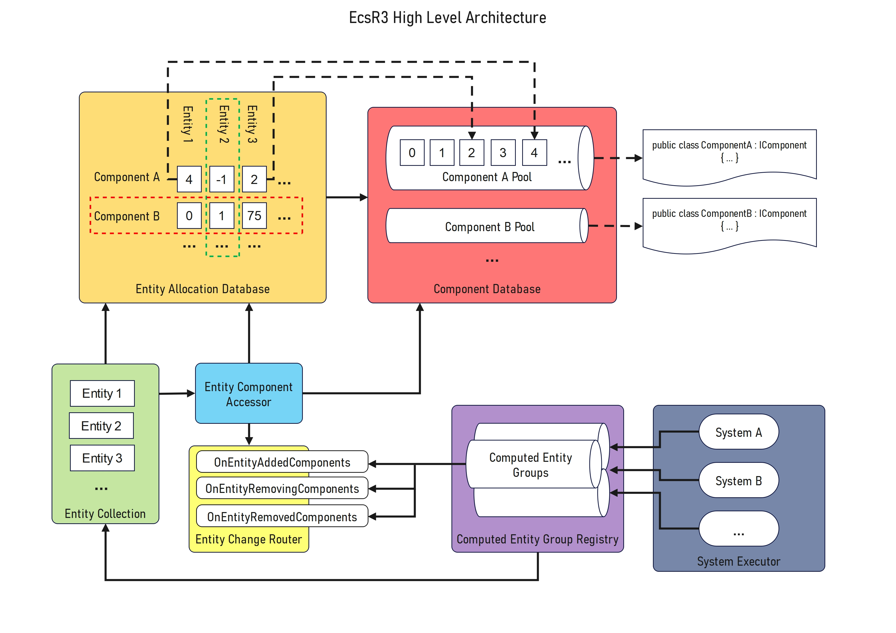

# High Level Architecture

From a high level perspective EcsR3 is built on top of SystemsR3, we make use of SystemR3's `ISystemsExecutor` and `ISystem` notions while adding our own custom handlers and ECS paradigms on top.

If we were to look at the highest level of what the **MAIN** architectural components were it would look something like this:

This isn't 100% accurate and doesn't go into some of the more intricate parts of each high level components, but it should be enough to give some sort of visual indication of how things hang together, lets dive a bit deeper into each bit working from the lower levels upwards.

## Component Database

The component database is where all component data is stored, the database internally contains a `Component Pool` for each component type you have in your project.

> For example if you have 10 implementations of `IComponent` you will end up with 10 component pools

For the most part the component database acts more like a facade and provides a higher level API  that lets you access component data without having to manually go into each pool, this being said though certain systems may request the whole pool to operate on where high throughput is favoured.

> Historically components were stored on entities but it causes the memory to become extremely fragmented so this gives a large performance benefit.

### Component Pools

Under the hood of the `Component Database` these component pools are basically dynamically resized arrays of `T : IComponent`. 

As the name implies the components in here are *pooled*, this means indexes are allocated and freed up based upon entity needs. This means there is not a 1-1 between entity count and array size, as you could have 10,000 entities but only 10% of them have `HealthComponent` so this allows for savings in memory usage as it will only allocate as many components as needed, and inflate its size if required.

> There are pros and cons to this approach, it provides better memory utilisation at the cost of indirection of ownership, which is why we have the `Entity Allocation Database` which translates an entity id and component type into an allocation index into a given `Component Pool`.

## Entity Allocation Database

This is basically a huge `int[,]` which stores *allocation indexes* into the `Component Pools` within the `Component Database`. As you can see in the diagram each row is a component type, and each column is an entity that's been allocated.

> If we look at the first entity we can see it has both `Component A` and `Component B` and is at index 4 in the `Component A Pool` and index 0 in the `Component B Pool`, then if we look at the 2nd Entity we can see it has `-1` for `Component A Pool` which indicates there is no allocation, but it does have `Component B` at index 1 of `Component B Pool`.

While this may seem like a massive amount of memory, as its all `int` values it's not actually taking up a vast amount of memory, even if you had 10,000 entities and 100 component types, it would only have 1,000,000 `ints`, if you think of it like an image even a 1080p image has 2,073,600 pixels, so its less memory than a small texture by today's standards.

It's also worth noting that like `Component Pools` the `Entity Allocation Database` also does some level of *pooling* on the Entity IDs, so when an entity is removed, its id is freed up and provided to the next created entity to ensure maximum usage of the available memory, it also contains an `int` array of `Creation Hashes` for each entity, which can be used to confirm an entity is valid (we will touch on that more later).

> For example let's say I created 1000 entities from id 1-1000, then deleted `Entity 23`, if I created 2 new entities the first would be given the id `23` the second would be given `1001`.

## Entity Collection

There is only one `Entity Collection` and it houses all the active entities, in other frameworks it may be known as `World`, `Pool` or `Context` but here we just call it the `Entity Collection`.

It is mainly a wrapper over the complexity of the `Entity Allocation Database` and exposes a higher level API for creating/updating/removing entities, it also has a dependency on the `Entity Component Accessor` to allow for removal of components from entities when they are deleted.

> Historically in EcsRx there was the ability to have multiple `Entity Collection` instances but over time this complicated too many other parts of the architecture as you didn't have a singular place to check/manage entities.

### Entities
We should also discuss what an `Entity` is, as this is the first layer where we start seeing actual `Entity` instances vs just an entity Id.

The `Entity` is a `readonly struct` containing the `Id` of the entity, and a `CreationHash`, for the most part you will just pass the `Entity` instance around, and/or maybe use its `Id` directly for lookups in parts of your logic. 

The `CreationHash` is actually quite important internally and is needed because the `Entity` is not a reference type, so you could have a stale entity handle if some other part of the system cleared it up, and combining that with the re-use of `Id` allocations, you could end up in a situation where you have a stale `Entity` handle with the same Id as an active new `Entity`. So the `CreationHash` solves this problem by ensuring the `Entity Allocation Database` can take an `Entity` and verify it against the current hash for that given Id.

> For the most part you won't need to worry about this stale `Entity` problem, as the way EcsR3 is designed the internals always maintain up to date views of only active data, but if you end up caching entities yourself then this mechanism allows you to verify `Entity` is still in use.

## Entity Component Accessor

This is probably the most important piece of the puzzle for most users, as this allows you to do operations on entities and manage their components without having to know/care about the underlying lower level data containers. It is not quite a facade but it sits on top of the `Entity Allocation Database` and `Component Database` and provides a higher level API that bridges both concepts.

> For example if you want to add a component to an `Entity`, the `Entity Component Accessor` would first work out the component type id, then it would request the `Entity Allocation Database` provide an allocation id for that component type, which it can then provide to the `Component Database` to save the instance of the `IComponent` being used. 

You will find most `ISystem` implementations will provide this to you either via the `Process/Execute` method or for inheritance scenarios it will often be provided via a local property on the system, so you can always do single or batch operations on an `Entity/Entities`.

> Historically we had `IEntity` which was basically the `Entity Allocation Database` and `Entity Component Accessor` in a single object, but this meant you could only operate on that individual `Entity`, whereas now you can operate on many entities at once using batched operations which can provide big performance improvements, it also means memory isnt as fragmented given the `Entity Allocation Database` handles it all as one contiguous lump.

## Entity Change Router

This routes updates to components to `Computed Entity Group` instances via `Computed Entity Group Trackers` (omitted from diagram).

So as entities have components added/removed the `Groups` they are a part of will change, internally it keeps track of all components that `Computed Entity Groups` need to know about, and when an entity changes components within those id ranges it will notify them to tell them to update.

> For example if a `Computed Entity Group` required `ComponentA`, `ComponentB` but excludes `ComponentC` then the `Entity Change Router` would have a `ComponentContract` for the component type ids of A,B and a separate one for C and when any of those change it would notify the listeners who could then work out if its required components being added/removed, or excluded components being added/removed, this allows them to work out if an `Entity` should be added/removed from a `Computed Entity Group`.

## Computed Entity Group Registry

This registry contains all `Computed Entity Groups` and handles the high level accessing and creation of related computed groups when needed.

### Computed Entity Groups

As systems use groups as their contracts we have `Computed Entity Group` objects which deal with maintaining a list of applicable entities and notify any subscribers when they change in any way.

> These are kept up to date and drive large parts of the system, there are also `Computed Component Groups` which are not shown on the diagram but they are driven by the `Computed Entity Groups` but also create batch accessors for components in that group, so using those `Computed Component Groups` you can get all entities and their group components at once without having to go through any other lookups, which are what `BatchedSystems` use under the hood to be so fast.

As mentioned in the `Entity Change Router` each `Computed Entity Group` also uses a `ComputedEntityGroupTracker` to handle the group resolution and notifications so the instance itself is quite lightweight and only caches the entities it cares about.

## Systems Executor

The `System Executor` houses all systems within the framework, they are all setup internally by registered `System Handlers` which understand how to process certain kinds of system and wire up dependencies.

> In the real world most of the handlers are `IConventionalSystemHandler` implementations, but you can make your own versions of these if you want